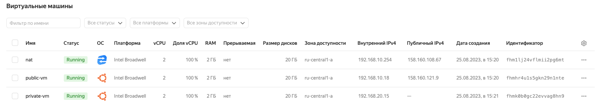
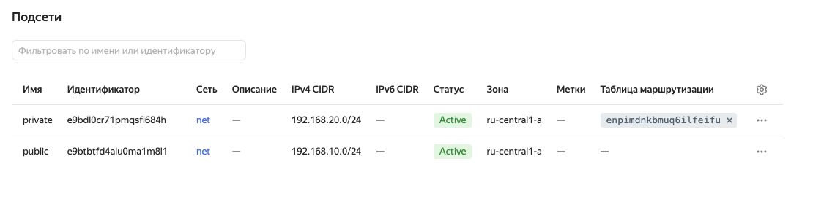

## Решение

Конфиги terraform лежат [тут]()

Outputs tf:
```bash
Apply complete! Resources: 7 added, 0 changed, 0 destroyed.

Outputs:

external_ip_address_nat = "158.160.108.67"
external_ip_address_private-vm = ""
external_ip_address_public-vm = "158.160.121.9"
internal_ip_address_nat = "192.168.10.254"
internal_ip_address_private-vm = "192.168.20.15"
internal_ip_address_public-vm = "192.168.10.18"
```

Получившиеся vm:


Subnets:


Routing Tables:


Проверка подключения к public vm:
```bash
vi:~/ $ ssh -i id_rsa ubuntu@158.160.121.9
Warning: Permanently added '158.160.121.9' (ED25519) to the list of known hosts.
Welcome to Ubuntu 22.04.2 LTS (GNU/Linux 5.15.0-76-generic x86_64)
ubuntu@public-vm:~$ ping ya.ru
PING ya.ru (77.88.55.242) 56(84) bytes of data.
64 bytes from ya.ru (77.88.55.242): icmp_seq=1 ttl=56 time=3.81 ms
64 bytes from ya.ru (77.88.55.242): icmp_seq=2 ttl=56 time=3.60 ms
^C
--- ya.ru ping statistics ---
2 packets transmitted, 2 received, 0% packet loss, time 1002ms
rtt min/avg/max/mdev = 3.595/3.700/3.805/0.105 ms
```

Проверка подключения к private vm:
```bash
ubuntu@public-vm:~$ ssh -i id_rsa ubuntu@192.168.20.15
Warning: Permanently added '192.168.20.15' (ED25519) to the list of known hosts.
Welcome to Ubuntu 22.04.2 LTS (GNU/Linux 5.15.0-76-generic x86_64)
ubuntu@private-vm:~$ ping google.com
PING google.com (64.233.161.138) 56(84) bytes of data.
64 bytes from lh-in-f138.1e100.net (64.233.161.138): icmp_seq=1 ttl=54 time=24.9 ms
64 bytes from lh-in-f138.1e100.net (64.233.161.138): icmp_seq=2 ttl=54 time=23.7 ms
^C
--- google.com ping statistics ---
2 packets transmitted, 2 received, 0% packet loss, time 1002ms
rtt min/avg/max/mdev = 23.664/24.263/24.863/0.599 ms
```