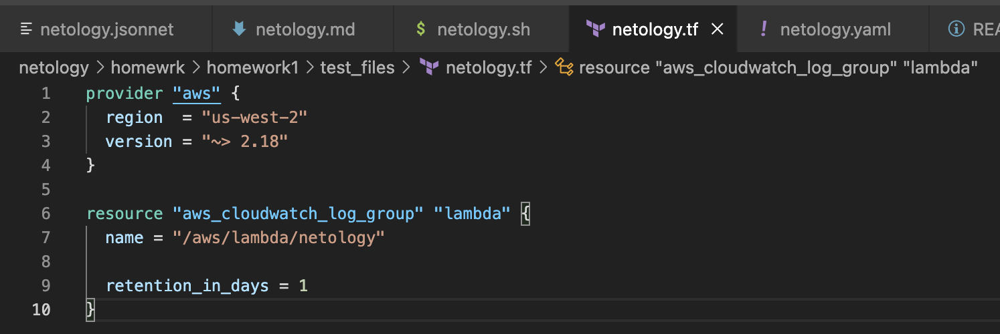
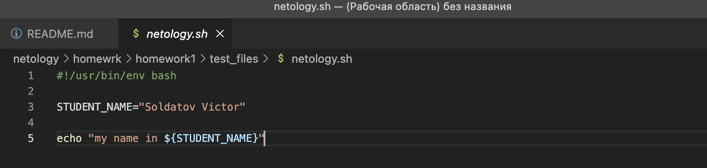
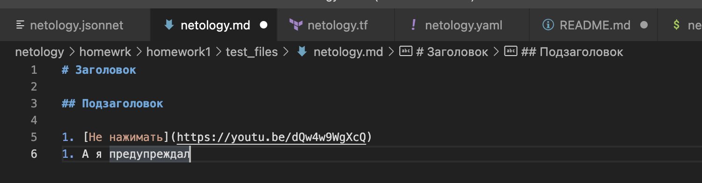
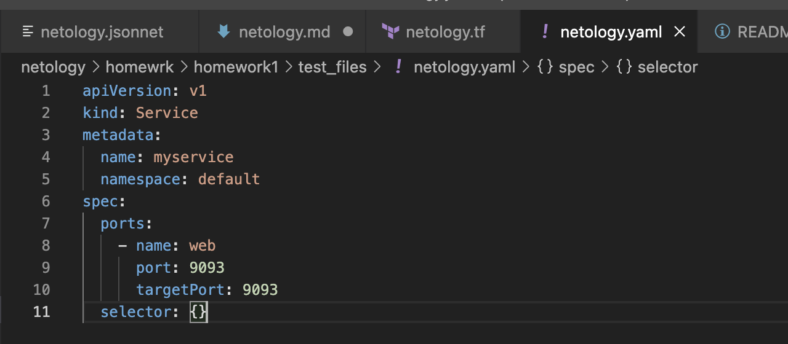
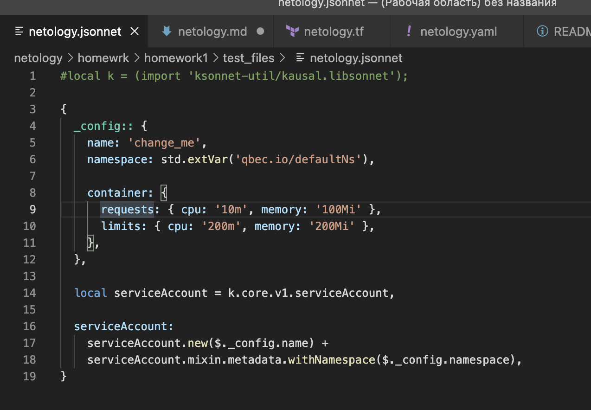

# Решения:

## Задание 1

Подсветка синтаксиса работает:
- Terraform: 
- Bash: 
- Markdown: 
- Yaml: 
- Jsonnet: 

## Задание 2

1) Постановка задачи от клиента\владельца продукта (менеджер, хотя по-хорошему в подобных митапах долны участвовать представители и от менеджеров, и от developers, и от operators)
2) Анализ (может быть совмещен и проведен вместе с заказчиком в рамках постановки задачи, если нет, то задача анализируется на предмет выполнимости и рентабильности со cтороны DevOps и разработчиков)
3) Дизайн (проектирование функционала и постановка целей на разработку (Developers), продумывание создания и автоматизации развертывания тестового окружения (DevOps))
4) Разработка (разработка нового функционала Developers, в коммуникации с DevOps, QA и Operators)
5) Тестирование (Тестирование нового функционала, QA совместно с DevOps)
6) Релиз (Выкатка релиза в прод, DevOps + Operators)
7) Фидбек

Если необходимая цель не достигнута - шаги 3-6 (7) повторяются

А вообще DevOps'ы участвуют почти во всех или во всех этапах жизненного цикла ПО - Plan-Develop-Build-Test-Release-Deploy-Operate-Monitor.