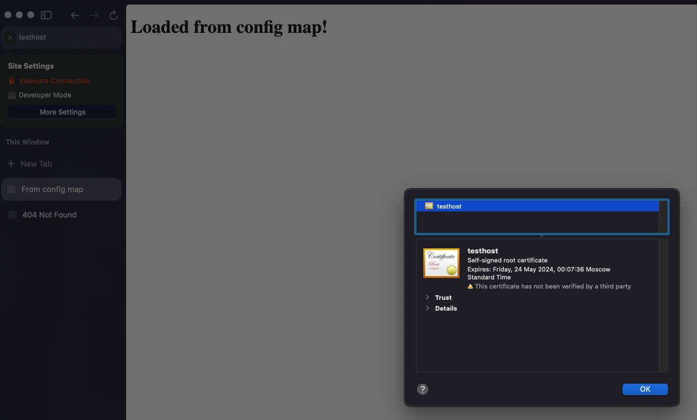

## Task 1

[Deployment](src/1-2-deployment.yaml), [Service](src/1-3-nginx-service.yaml) and [ConfigMap](src/1-1-config-map.yaml).

Честно говоря не понял, что надо фиксить с помощью configmap, всё запустилось и без него.

Выводы команд:

```bash
vi:src/ $ curl 192.168.64.4:30080
<!DOCTYPE html>
<html lang="en">
  <head>
    <title>From config map</title>
  </head>
  <body>
  
    <h1>Loaded from config map!</h1>
  
  </body>
</html>
```

Бонусом скрин nginx в работе:


## Task 2

[Deployment](src/2-1-deployment.yaml), [Service](src/2-2-service.yaml) and [Ingress](src/2-3-ingress.yaml).

`ConfigMap` использовал из предыдущей задачи.

Выводы команд:

```bash
# Генерируем самоподписанный сертификат
vi:src/ $ openssl req -x509 -newkey rsa:4096 -sha256 -nodes -keyout tls.key -out tls.crt -subj "/CN=testhost" -days 365
Generating a 4096 bit RSA private key
.................................................++++
........................++++
writing new private key to 'tls.key'
# Добавляем секрет
vi:src/ $ kubectl create secret tls test-secret --cert=tls.crt --key=tls.key
secret/test-secret created
# Деплоим наше приложение
vi:src/ $ kubectl apply -f 2-1-deployment.yaml
deployment.apps/task-2 created
vi:src/ $ kubectl apply -f 2-2-service.yaml
service/nginx-nodeport-svc created
vi:src/ $ kubectl apply -f 2-3-ingress.yaml
ingress.networking.k8s.io/test-ingress created
# Проверяем доступ по https
vi:src/ $ curl --insecure https://testhost/
<!DOCTYPE html>
<html lang="en">
  <head>
    <title>From config map</title>
  </head>
  <body>
  
    <h1>Loaded from config map!</h1>
  
  </body>
</html>
```

Бонусом скрин nginx и самоподписанного сертификата в работе:

