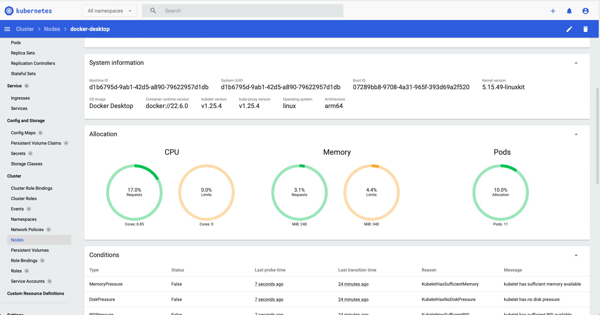

## Task

Вывод `kubectl get nodes`:

```bash
vi:~/ $ kubectl get nodes                                                                              
NAME             STATUS   ROLES           AGE   VERSION
docker-desktop   Ready    control-plane   22m   v1.25.4
```

Скрин рабочего dashboard:

