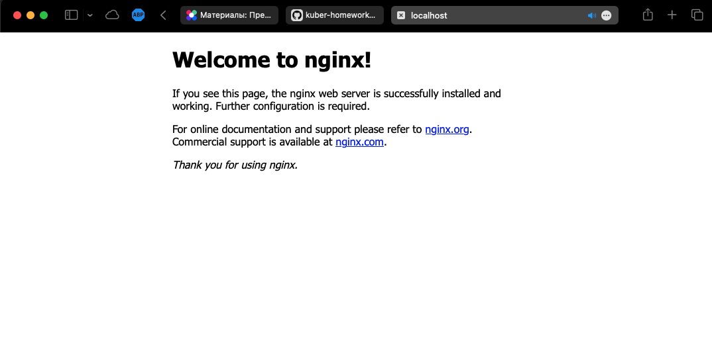

## Task 1

Deployment и service в одном [манифесте](src/1-1-multi-deployment.yaml)

```bash
vi:src/ $ kubectl get deployments
NAME               READY   UP-TO-DATE   AVAILABLE   AGE
multi-deployment   3/3     3            3           68s
vi:src/ $ kubectl get pods
NAME                                READY   STATUS    RESTARTS   AGE
multi-deployment-57f85d7d9b-lzl6p   2/2     Running   0          87s
multi-deployment-57f85d7d9b-spw59   2/2     Running   0          87s
multi-deployment-57f85d7d9b-vkjdn   2/2     Running   0          87s
```

Создал отдельный [pod](src/1-2-solo-pod.yaml), зашёл в него и проверил доступ с помощью `curl`:
```bash
vi:src/ $ kubectl apply -f 1-2-solo-pod.yaml
pod/multitool created
vi:src/ $ kubectl get pods
NAME                                READY   STATUS    RESTARTS   AGE
multi-deployment-57f85d7d9b-lzl6p   2/2     Running   0          2m30s
multi-deployment-57f85d7d9b-spw59   2/2     Running   0          2m30s
multi-deployment-57f85d7d9b-vkjdn   2/2     Running   0          2m30s
multitool                           1/1     Running   0          31s
vi:src/ $ kubectl exec -it multitool /bin/bash
bash-5.1# curl multi-deployment-svc:9001
<!DOCTYPE html>
<...>
<title>Welcome to nginx!</title> # пропустил вывод, там стандартная страничка nginx
<...>
bash-5.1# curl multi-deployment-svc:9002
WBITT Network MultiTool (with NGINX) - multi-deployment-57f85d7d9b-lzl6p - 10.1.0.73 - HTTP: 8080 , HTTPS: 8433 . (Formerly praqma/network-multitool)
```

## Task 2

Создал [service](src/2-1-nginx-service.yaml), выводы команд:

```bash
vi:src/ $ kubectl apply -f 2-1-nginx-service.yaml
service/nginx-nodeport-svc created
vi:src/ $ kubectl get services
NAME                   TYPE        CLUSTER-IP       EXTERNAL-IP   PORT(S)             AGE
kubernetes             ClusterIP   10.96.0.1        <none>        443/TCP             6d
multi-deployment-svc   ClusterIP   10.106.203.238   <none>        9001/TCP,9002/TCP   22m
nginx-nodeport-svc     NodePort    10.100.119.252   <none>        80:30080/TCP        2s
vi:src/ $ curl localhost:30080
<!DOCTYPE html>
<...>
<title>Welcome to nginx!</title> # пропустил вывод, там стандартная страничка nginx
<...>
```

Бонусом скрин nginx в работе:

