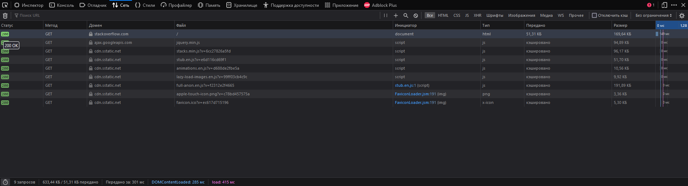

# Answers to questions

1. Код 301 - Moved Permanently - запрошенный ресурс был на постоянной основе перемещён в новое месторасположение.
2. Код 200 - OK - Запрос выполнен успешно.
   Дольше всего обрабатывался запрос на получение html-страницы, ибо всё кешировано. Скриншот: 
3. 212.35.xxx.xxx (надеюсь, весь его сообщать не обязательно)
4. Rostelecom networks, AS - AS12389 
5. Использую win, так что не удивляйтесь (так же до 8.8.8.8 трассировка не особо захотела топать, поэтому пошёл на 1.1.1.1):
   ```
   tracert 1.1.1.1
   Трассировка маршрута к one.one.one.one [1.1.1.1]
   с максимальным числом прыжков 30:

     1    <1 мс    <1 мс    <1 мс  192.168.1.1
     2     1 ms     1 ms     1 ms  100.124.176.1
     3     1 ms     1 ms     1 ms  213.59.232.198
     4     2 ms     1 ms     1 ms  213.59.233.253
     5     1 ms     1 ms     3 ms  213.59.233.248
     6    13 ms    13 ms    13 ms  188.128.126.247
     7     *        *        *     Превышен интервал ожидания для запроса.
     8    12 ms    12 ms    12 ms  95.71.2.226
     9    13 ms    13 ms    13 ms  one.one.one.one [1.1.1.1]
   ```
   AS12389, AS13335
6. Наибольшая средняя задержка на узле 188.128.126.247 
   ```
   |------------------------------------------------------------------------------------------|
   |                                      WinMTR statistics                                   |
   |                       Host              -   %  | Sent | Recv | Best | Avrg | Wrst | Last |
   |------------------------------------------------|------|------|------|------|------|------|
   |                             192.168.1.1 -    0 |  237 |  237 |    0 |    0 |    0 |    0 |
   |                           100.124.176.1 -    0 |  237 |  237 |    1 |    3 |   65 |    1 |
   |                          213.59.232.198 -    0 |  237 |  237 |    1 |    2 |   42 |    1 |
   |                          213.59.233.253 -    0 |  237 |  237 |    1 |    2 |   47 |    1 |
   |                          213.59.233.248 -    0 |  237 |  237 |    1 |    1 |   42 |    1 |
   |                         188.128.126.247 -    0 |  237 |  237 |   13 |   14 |   53 |   13 |
   |                   No response from host -  100 |   47 |    0 |    0 |    0 |    0 |    0 |
   |                             95.71.2.226 -    0 |  237 |  237 |   12 |   13 |   45 |   12 |
   |                         one.one.one.one -    0 |  237 |  237 |   13 |   13 |   20 |   13 |
   |________________________________________________|______|______|______|______|______|______|
     WinMTR v0.92 GPL V2 by Appnor MSP - Fully Managed Hosting & Cloud Provider
   ```
7. A-записи:
   ```
   ;; ANSWER SECTION:
   dns.google.		5	IN	A	8.8.8.8
   dns.google.		5	IN	A	8.8.4.4
   ```
   NS-сервера:
   ```
   dns.google. 2681 IN NS ns3.zdns.google.
   dns.google. 2681 IN NS ns2.zdns.google.
   dns.google. 2681 IN NS ns1.zdns.google.
   dns.google. 2681 IN NS ns4.zdns.google.
   ```
8. Внезапно, доменное имя dns.google:
   ```
   ;; ANSWER SECTION:
   4.4.8.8.in-addr.arpa.	5	IN	PTR	dns.google.
   <...>
   ;; ANSWER SECTION:
   8.8.8.8.in-addr.arpa.	5	IN	PTR	dns.google.
   ```

ps. Часть заданий делалась под win, часть под linux.