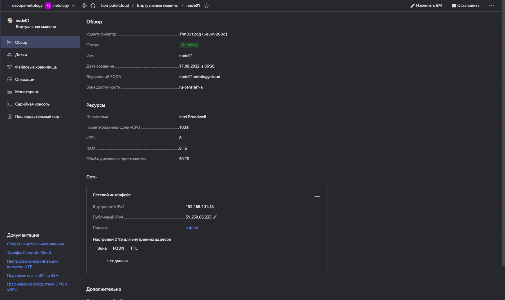
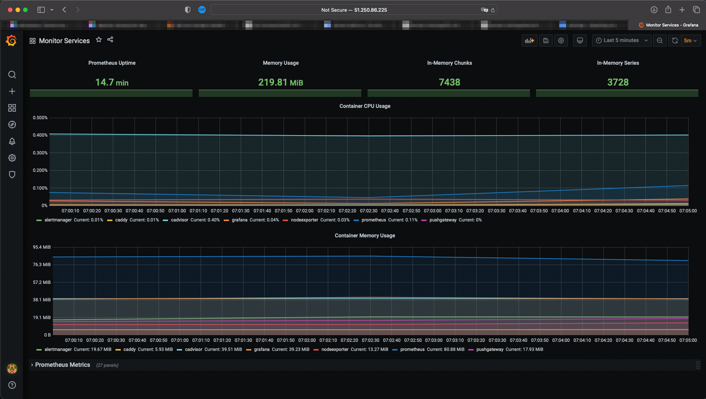
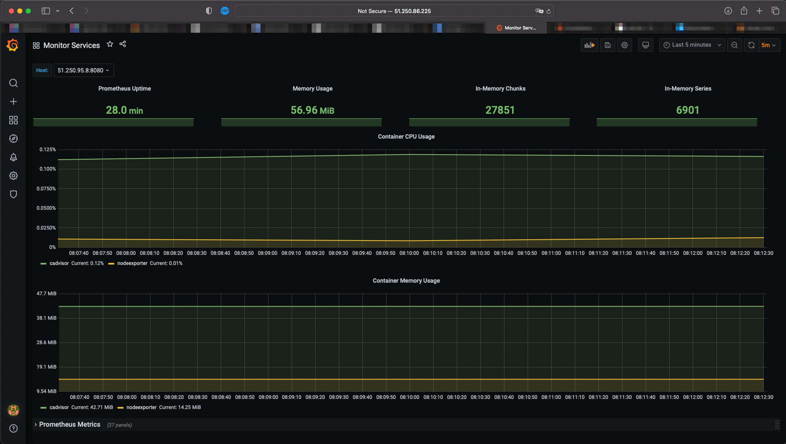

# Tasks

1. Output:
   ```bash
   $ yc compute image list
   +----------------------+---------------+--------+----------------------+--------+
   |          ID          |     NAME      | FAMILY |     PRODUCT IDS      | STATUS |
   +----------------------+---------------+--------+----------------------+--------+
   |     *here-is-id*     | centos-7-base | centos |    *here-is-ids*     | READY  |
   +----------------------+---------------+--------+----------------------+--------+
   ```
2. Screenshot
   
3. Screenshot
   
4. (*) Поднял на второй ноде cAdvisor и node_exporter, чуть переделал дашборд в графане, чтобы показать, что метрики собираются.
   (!)Поменял только Memory usage, Container CPU Usage and Container Memory usage, ибо на второй ноде прометей не запущен.
   