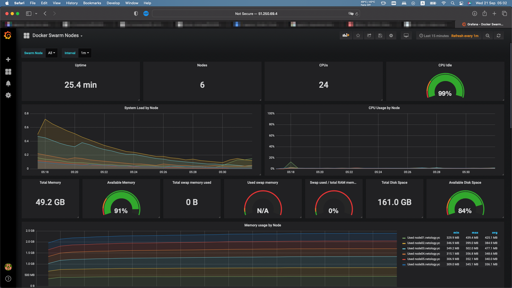

# Tasks

1. Answers:
    * Replicated - n-ое количество контейнеров для данного сервиса будет запущено на всех доступных нодах. Global - один экземпляр сервиса на всех нодах.
    * Используется Raft как алгоритм консенсуса. Raft требует, чтобы большинство членов кластера согласились на изменение, и допускает `(n-1)/2`(где `n` - число членов кластера) сбоев. В случае недоступности лидера, его роль берет на себя одна из нод-менеджеров (если за нее проголосовало большинство менеджеров). Реализуется это за счет таймаутов. Если в течение определенного времени менеджер не получил данные от лидера - он объявляет себя кандидатом и другие ноды голосуют за него.
    * Overlay сеть - это сеть между несколькими демонами Docker. Она перекрывает сети хоста и позволяет контейнерам безопасно обмениваться данными (с использованием сертификатов и шифрования). Docker выступает в роли маршрутизатора пакетов к нужному хосту и контейнеру.
2. По факту с вашими `src` 2-ое и 3-е задание выполняются при `terraform apply` и, хоть с первого раза не вышло, я добился того, что кластер разворачивается автоматом в течении 5-10 минут с нуля за одну команду. Образ использовал с прошлой дз, оказалось за него тоже берутся деньги... учту и в этот раз почищу всё.
   ```bash
   Apply complete! Resources: 13 added, 0 changed, 0 destroyed.
   ```
   ```bash
   [root@node01 ~]# docker node ls
   ID                            HOSTNAME             STATUS    AVAILABILITY   MANAGER STATUS   ENGINE VERSION
   zossafpu5r402czpc027u7xo7 *   node01.netology.yc   Ready     Active         Leader           20.10.18
   cackvciwjt023mdpcy4b29y22     node02.netology.yc   Ready     Active         Reachable        20.10.18
   6dva2cvm86jx6tichysqba2b5     node03.netology.yc   Ready     Active         Reachable        20.10.18
   3fqwg5zwjcm6dhfv93bwtm94m     node04.netology.yc   Ready     Active                          20.10.18
   kv841uf10zaw1eaxe220t2vrz     node05.netology.yc   Ready     Active                          20.10.18
   smbvo4tqezp3gk9w4u973w6bh     node06.netology.yc   Ready     Active                          20.10.18
   ```
3. Output and screenshot:
   ```bash
   [root@node01 ~]# docker service ls
   ID             NAME                                MODE         REPLICAS   IMAGE                                          PORTS
   ar4qcuo1v4fn   swarm_monitoring_alertmanager       replicated   1/1        stefanprodan/swarmprom-alertmanager:v0.14.0
   0sun6l0cgw65   swarm_monitoring_caddy              replicated   1/1        stefanprodan/caddy:latest                      *:3000->3000/tcp, *:9090->9090/tcp, *:9093-9094->9093-9094/tcp
   y5vmdpxtvt1t   swarm_monitoring_cadvisor           global       6/6        google/cadvisor:latest
   6cgfx9cmhunf   swarm_monitoring_dockerd-exporter   global       6/6        stefanprodan/caddy:latest
   qkodflw5sjsu   swarm_monitoring_grafana            replicated   1/1        stefanprodan/swarmprom-grafana:5.3.4
   yg0leh492tah   swarm_monitoring_node-exporter      global       6/6        stefanprodan/swarmprom-node-exporter:v0.16.0
   ucncu4ppgk94   swarm_monitoring_prometheus         replicated   1/1        stefanprodan/swarmprom-prometheus:v2.5.0
   iif8kbpj0b8m   swarm_monitoring_unsee              replicated   1/1        cloudflare/unsee:v0.8.0
   ```
   
4. (*) Флаг `--autolock=true` включает автоблокировку swarm после ребута ноды(применяется на всех manager в кластере). Когда демон докера перезапускается ключ для общения между нодами и ключ для шифровки/расшифровки логов рафта загружается в память каждой ноды. С помощью этого флага можно затребовать ручную разблокировку ноды после рестарта (с помощью уникального ключа, шифрующего те два, который генерируется при включении автоблокировки).
   ```bash
   # Проверяем статус кластера
   [root@node01 ~]# docker node ls
   ID                            HOSTNAME             STATUS    AVAILABILITY   MANAGER STATUS   ENGINE VERSION
   zossafpu5r402czpc027u7xo7 *   node01.netology.yc   Ready     Active         Leader           20.10.18
   cackvciwjt023mdpcy4b29y22     node02.netology.yc   Ready     Active         Reachable        20.10.18
   6dva2cvm86jx6tichysqba2b5     node03.netology.yc   Ready     Active         Reachable        20.10.18
   3fqwg5zwjcm6dhfv93bwtm94m     node04.netology.yc   Ready     Active                          20.10.18
   kv841uf10zaw1eaxe220t2vrz     node05.netology.yc   Ready     Active                          20.10.18
   smbvo4tqezp3gk9w4u973w6bh     node06.netology.yc   Ready     Active                          20.10.18
   # Включаем автоблокировку
   [root@node01 ~]# docker swarm update --autolock=true
   Swarm updated.
   To unlock a swarm manager after it restarts, run the `docker swarm unlock`
   command and provide the following key:

       SWMKEY-1-Dl6zaSXI1rGHb1uvc07wKkQnMdzU+cbmeIJja4QygUk

   Please remember to store this key in a password manager, since without it you
   will not be able to restart the manager.
   # Перезагружаем ноду
   [root@node01 ~]# reboot
   Connection to 1.1.1.1 closed by remote host.
   # Проверяем статус кластера с другой ноды (которая стала мастером)
   [root@node02 ~]# docker node ls
   ID                            HOSTNAME             STATUS    AVAILABILITY   MANAGER STATUS   ENGINE VERSION
   zossafpu5r402czpc027u7xo7     node01.netology.yc   Down      Active         Unreachable      20.10.18
   cackvciwjt023mdpcy4b29y22 *   node02.netology.yc   Ready     Active         Leader           20.10.18
   6dva2cvm86jx6tichysqba2b5     node03.netology.yc   Ready     Active         Reachable        20.10.18
   3fqwg5zwjcm6dhfv93bwtm94m     node04.netology.yc   Ready     Active                          20.10.18
   kv841uf10zaw1eaxe220t2vrz     node05.netology.yc   Ready     Active                          20.10.18
   smbvo4tqezp3gk9w4u973w6bh     node06.netology.yc   Ready     Active                          20.10.18
   # Анлочим 1-ую ноду
   [root@node01 ~]# docker swarm unlock
   # Проверяем статус кластера
   [root@node02 ~]# docker node ls
   ID                            HOSTNAME             STATUS    AVAILABILITY   MANAGER STATUS   ENGINE VERSION
   zossafpu5r402czpc027u7xo7     node01.netology.yc   Ready     Active         Reachable        20.10.18
   cackvciwjt023mdpcy4b29y22 *   node02.netology.yc   Ready     Active         Leader           20.10.18
   6dva2cvm86jx6tichysqba2b5     node03.netology.yc   Ready     Active         Reachable        20.10.18
   3fqwg5zwjcm6dhfv93bwtm94m     node04.netology.yc   Ready     Active                          20.10.18
   kv841uf10zaw1eaxe220t2vrz     node05.netology.yc   Ready     Active                          20.10.18
   smbvo4tqezp3gk9w4u973w6bh     node06.netology.yc   Ready     Active                          20.10.18
   # Отключаем автоблокировку
   [root@node01 ~]# docker swarm update --autolock=false
   ```

---

P.S. Классная штука этот caddy, надо будет почитать.