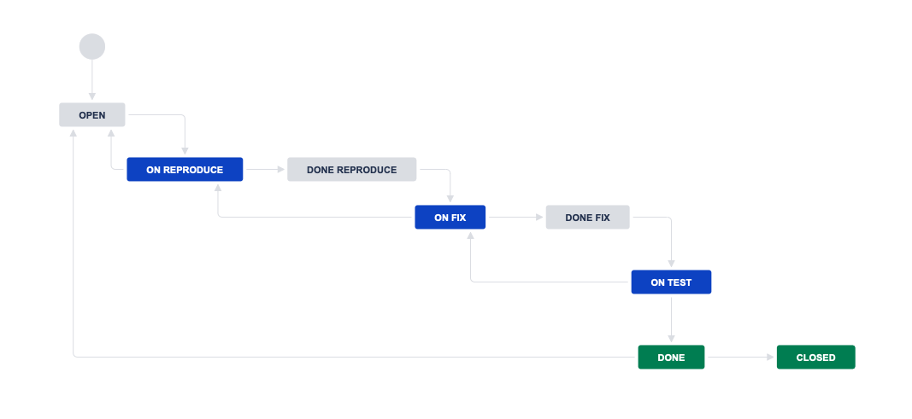
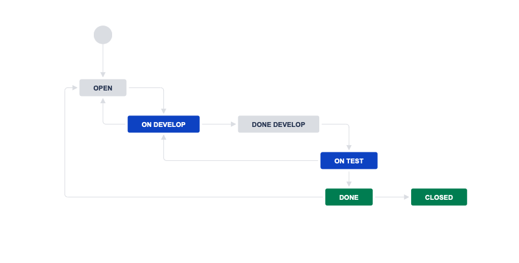

Description
=========

Workflow для задач типа `Bug` ([xml](src/bug.xml)):

Workflow для остальных задач ([xml](src/all_tasks.xml)):

P.S.
------------
Промежуточные `done` (по типу `done develop, done reproduce and done fix`) причислил к типу `to do`, так как по факту они являются переходным этапом и сигнализируют членам команды, что задача свободна для выполнения (например, тестировщик воспроизвёл баг и передал на фикс команде разработки, комонда разработки выпустила фикс - тестировщики ушли тестировать и тд.).