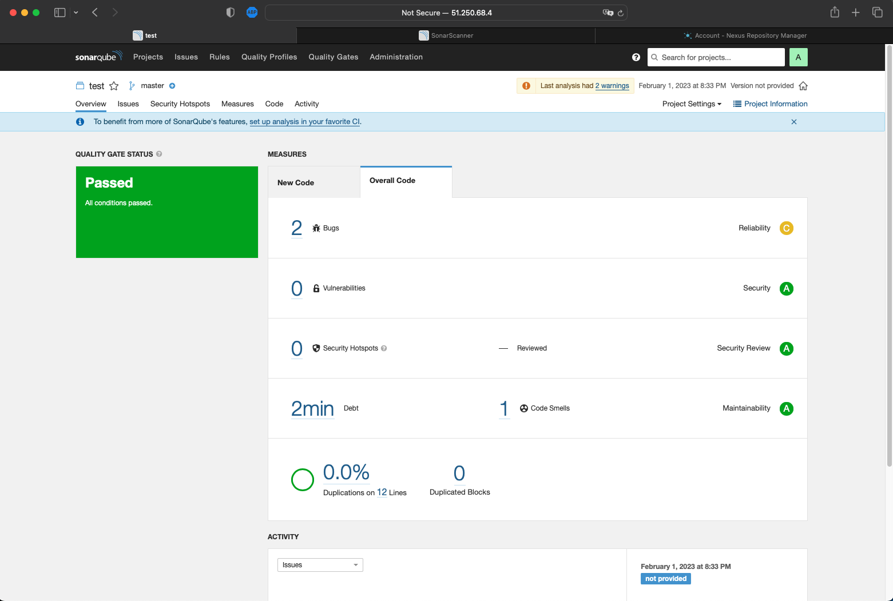
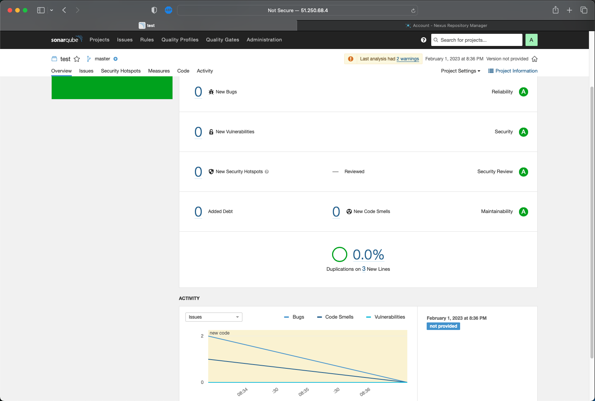

Description
=========

Разворачивать руками вм-ки и плейбук как-то скучно, да и tf вроде изучали, поэтому использовал его для деплоя vm и сетапа стека через плейбук.

SonarQube
---------

Перед фиксом:

После фиксов ([pass.py](answers/pass.py)):

Nexus
---------

Исправленный [maven-metadata.xml](answers/maven-metadata.xml)

Maven
---------

Исправленный [pom.xml](answers/pom.xml)