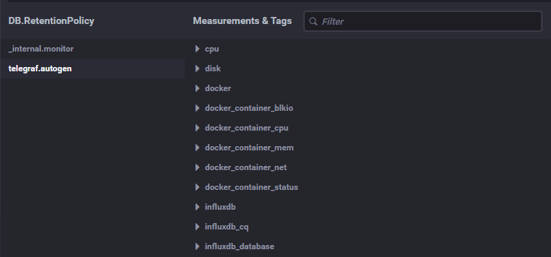

Description
=========

Answers
---------

1. Список метрик:
   - CPU Utilization - так как проект нагрует cpu;
   - Доступность проекта по http (на уровне проверок с кодами ответов);
   - Метрики дисковой подсистемы - так как необходимо отслеживать деградацию дисков для избежания потери данных;
   - Сетевые метрики (количество соединений, количество отброшенных пакетов, утилизация канала связи, скорость передачи данных) - для оценки нагрузки при обращениях;
   - Бизнес-метрики (как пример количество уникальных/всех запросов) - наверняка попросят;
   - (не обязательно, но очень полезно) Метрики RAM - явно в сервисе не обозначена нагрузка на ram, но лучше мониторить, чтобы избежать oom как минимум.
2. Заключить SLA об уровне обслуживания, качество которого будет описано в SLO. В качестве метрики - SLI, что бы следить за фактически предоставляемом уровне обслуживания. Эти метрики как раз и существуют для связывания измеряемых технических значений с бизнес-составляющей.
3. Бесплатная облачная версия sentry должна покрыть потребности разработки.
4. Так не учли же 3хх коды, правильная формула: `(summ_2xx_requests + summ_3xx_requests)/(summ_all_requests)`
5. Плюсы pull-систем:
   - легче контролировать подлинность данных;
   - можно настроить единый proxy server до всех агентов с TLS;
   - упрощённая отладка получения данных с агентов.

   К минусам pull-систем можно отнести сложность мониторинга динамически изменяющегося окружения.
   
   Плюсы push-систем:
   - упрощение репликации данных в разные системы мониторинга или их резервные копии;
   - более гибкая настройка отправки пакетов данных с метриками;
   - UDP — это менее затратный способ передачи данных, из-за чего может возрасти производительность сбора метрик.
   
   К минусам - большое количество точек конфигурирования.
6. Системы мониторинга по моделям:
   - Prometheus - Pull. Можно отправлять метрики по Push модели при помощи push gateway, но Prometheus будет их забирать как Pull;
   - TICK - Push. Агент Telegraf отправляет данные в БД InfluxDB. Telegraf при этом можно настроить на работу по Pull модели;
   - Zabbix - Push и Pull в зависимости от проверок;
   - VictoriaMetrics - Push;
   - Nagios - Pull;
7. Ну, поехали:
   ```bash
   $curl http://localhost:8086/ping -v
   *   Trying 127.0.0.1:8086...
   * Connected to localhost (127.0.0.1) port 8086 (#0)
   > GET /ping HTTP/1.1
   > Host: localhost:8086
   > User-Agent: curl/7.86.0
   > Accept: */*
   > 
   * Mark bundle as not supporting multiuse
   < HTTP/1.1 204 No Content
   < Content-Type: application/json
   < Request-Id: c689af6e-aeb1-11ed-80e6-0242ac120003
   < X-Influxdb-Build: OSS
   < X-Influxdb-Version: 1.8.10
   < X-Request-Id: c689af6e-aeb1-11ed-80e6-0242ac120003
   < Date: Fri, 17 Feb 2023 10:56:48 GMT
   < 
   * Connection #0 to host localhost left intact
   ```
   ```html
   curl http://localhost:8888
   <!DOCTYPE html><html><head><link rel="stylesheet" href="/index.c708214f.css"><meta http-equiv="Content-type" content="text/html; charset=utf-8"><title>Chronograf</title><link rel="icon shortcut" href="/favicon.70d63073.ico"></head><body> <div id="react-root" data-basepath=""></div> <script type="module" src="/index.e81b88ee.js"></script><script src="/index.a6955a67.js" nomodule="" defer></script> </body></html>%  
   ```
   ```bash
   curl http://localhost:9092/kapacitor/v1/ping -v
   *   Trying 127.0.0.1:9092...
   * Connected to localhost (127.0.0.1) port 9092 (#0)
   > GET /kapacitor/v1/ping HTTP/1.1
   > Host: localhost:9092
   > User-Agent: curl/7.86.0
   > Accept: */*
   > 
   * Mark bundle as not supporting multiuse
   < HTTP/1.1 204 No Content
   < Content-Type: application/json; charset=utf-8
   < Request-Id: 1affa77a-aeb3-11ed-8183-0242ac120005
   < X-Kapacitor-Version: 1.6.5
   < Date: Fri, 17 Feb 2023 11:06:19 GMT
   < 
   * Connection #0 to host localhost left intact
   ```

   Ну и скрин:

   

8. Вот и метрика утилизации диска:

   

9. Пришлось запариться, ибо на моей ос дать адкеватный доступ к сокету весьма трудно, но:
    
   