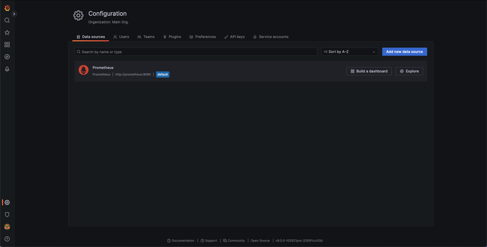
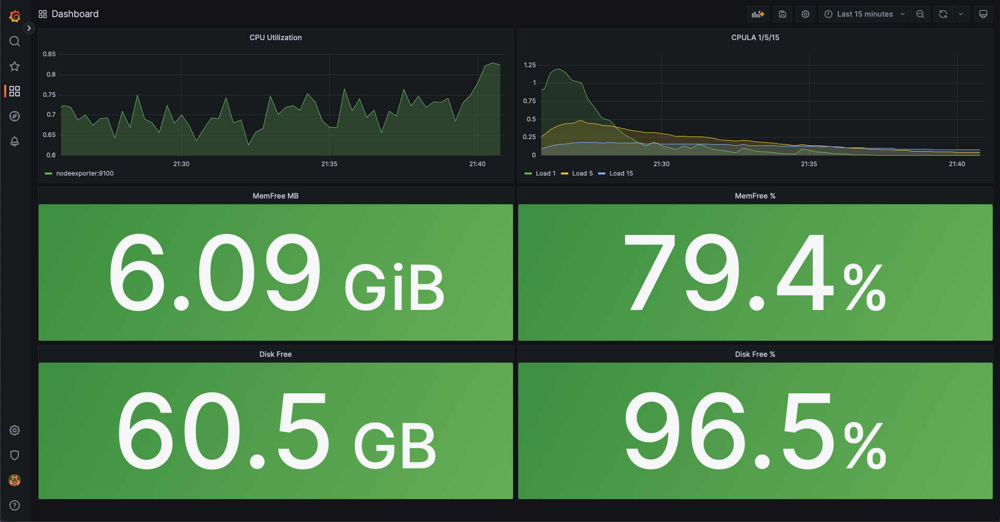
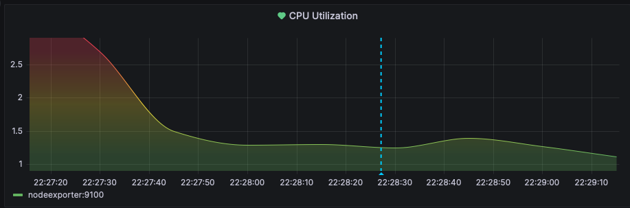

Description
=========

Писал файлы сам, лежат [тут](src/app/).

Answers
---------

1. Скрин:
   
   

2. Запросы:
   * Утилизация CPU для nodeexporter (в процентах, 100-idle) - `100 - (avg by (instance) (rate(node_cpu_seconds_total{job="nodeexporter",mode="idle"}[1m])) * 100)`;
   * CPULA 1/5/15 - `node_load(#1,5,15 - выбор интервала, метрики отдельные){job="nodeexporter"}`;
   * Количество свободной оперативной памяти - `node_memory_MemFree_bytes / (1024 * 1024)`, `(node_memory_MemFree_bytes / node_memory_MemTotal_bytes) * 100`;
   * Количество места на файловой системе - `node_filesystem_free_bytes{fstype!~"tmpfs|fuse.lxcfs|squashfs|vfat"} / (1024 * 1024 * 1024)`, `(node_filesystem_free_bytes{fstype!~"tmpfs|fuse.lxcfs|squashfs|vfat"} / node_filesystem_size_bytes{fstype!~"tmpfs|fuse.lxcfs|squashfs|vfat"}) * 100`.

   Скрин:

    

3. Я создал только один alert, для примера, тк нагружать основную машину для тестирования не хочу, а алерты без тестирования такое себе. Скрин:
   
   

4. Dashboard [json](src/dashbord.json)