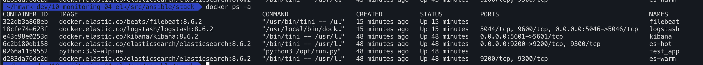
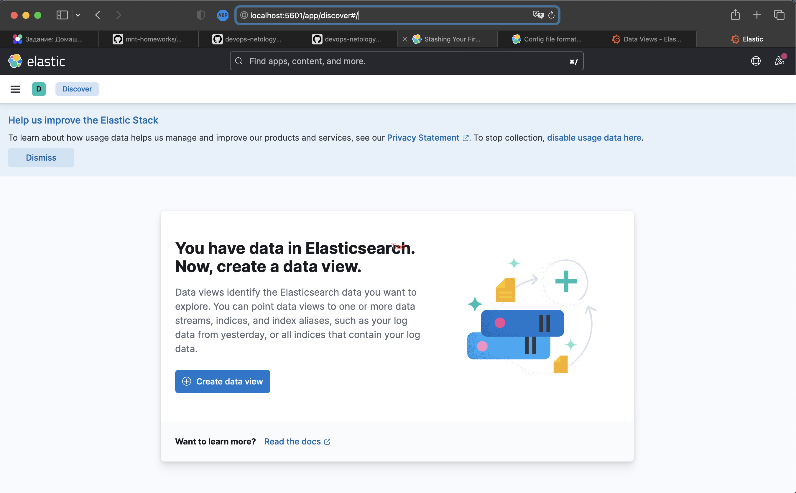
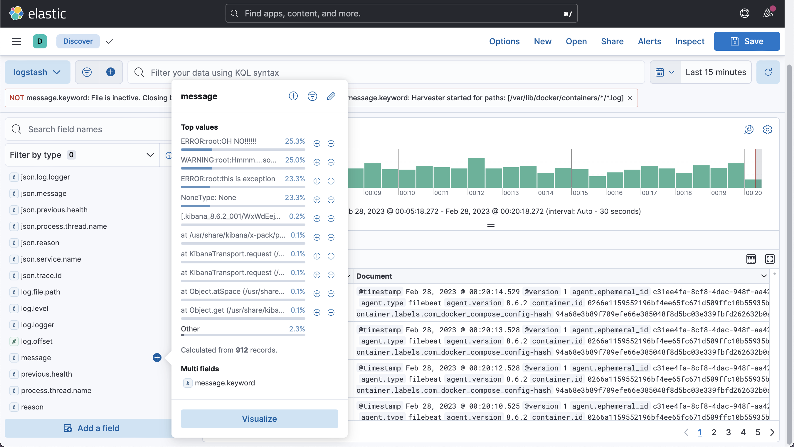

Description
=========

Task 1
---------

1. `docker ps -a`:
   
   

2. Kibana:
   
   

3. [docker-compose.yml](src/stack/docker-compose.yml)
4. Конфиги для стека [тут](src/stack/configs/).

Из help взял только `pinger`.

Task 2
---------

Добавил один паттерн, логи тестовой программы появились:

